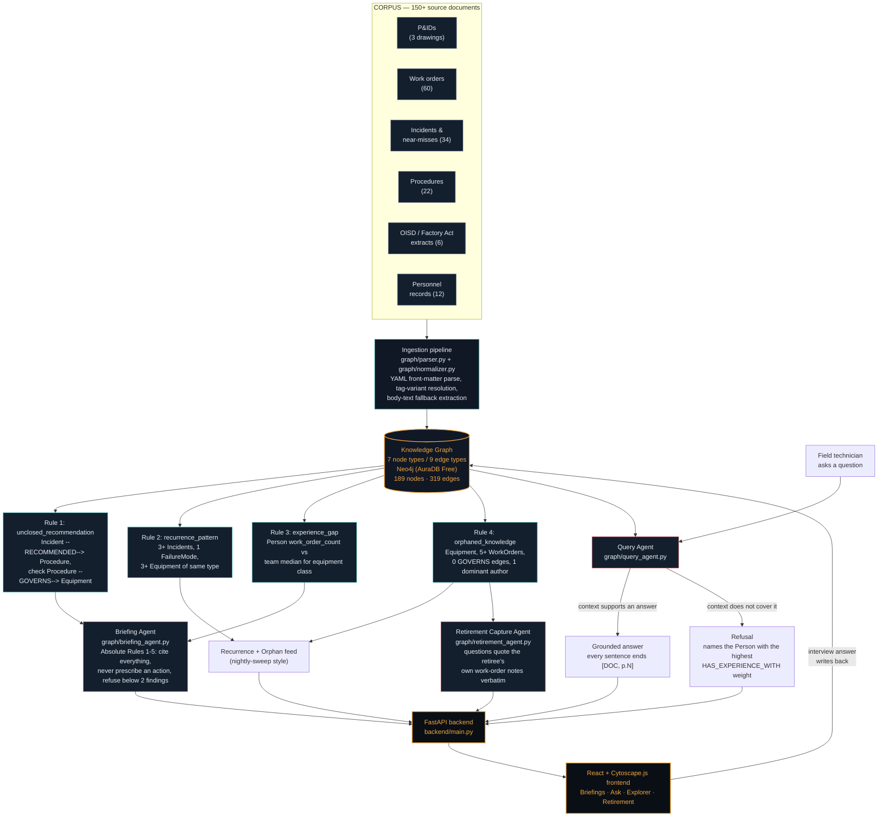
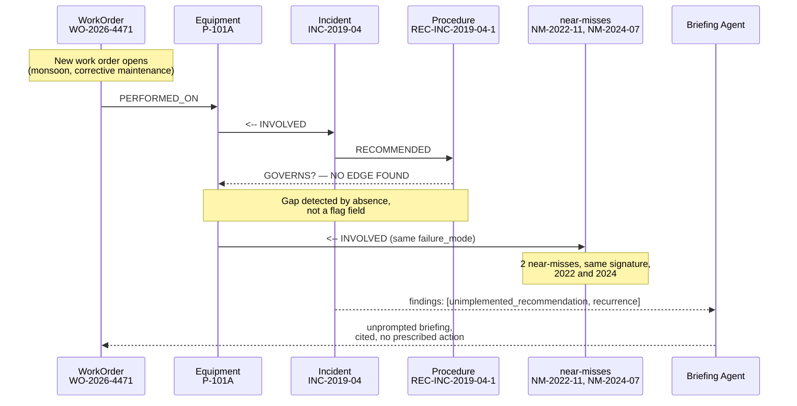

# PlantMind — Architecture

**Kaveri Refinery Unit 3 knowledge graph platform — ET AI Hackathon 2026, Problem Statement 1**

The core design bet: **traversal does the reasoning, the LLM only writes.** Four hardcoded graph rules detect conditions; language models never decide what matters, only narrate what a rule already found. That inversion is what keeps proactive alerts reliable instead of hallucinated.

---

## System overview

---

## The one traversal that fires the flagship demo

Storyline 1 — the unclosed loop on **P-101A** — is a single traversal, not a rules engine:

---

## Ontology — 7 node types, 9 edges, nothing added

| Node type | Carries |
|---|---|
| `Equipment` | tag, name, type, unit, criticality, pid_ref |
| `FailureMode` | canonical failure taxonomy (mechanical_seal_failure, tube_sheet_fouling, …) |
| `WorkOrder` | raised_date, work_type, priority, completion_notes |
| `Incident` | classification (incident / near_miss), date, failure mode link |
| `Procedure` | revision, status, satisfies_clauses |
| `RegulatoryClause` | doc_id, clause text, source page |
| `Person` | role, tenure, specialization |

Every node also carries `source_document`, `page`, and `confidence` — the triplet that makes citation, and refusal, possible.

| Edge | From → To | Notes |
|---|---|---|
| `HAS_FAILURE_MODE` | Equipment → FailureMode | known failure modes for the equipment class |
| `PERFORMED_ON` | WorkOrder → Equipment | |
| `ASSIGNED_TO` | WorkOrder → Person | |
| `INVOLVED` | Incident → Equipment | |
| `EXHIBITED` | Incident → FailureMode | |
| `RECOMMENDED` | Incident → Procedure | carries owner + target date |
| `GOVERNS` | Procedure → Equipment | its *absence* is the signal for the unclosed-loop rule |
| `SATISFIES` | Procedure → RegulatoryClause | |
| `HAS_EXPERIENCE_WITH` | Person → Equipment | derived by aggregating WorkOrder edges, not extracted |

---

## Running on real Neo4j (AuraDB Free)

No Docker in the build environment, so instead of a local container the graph runs on a free-tier AuraDB instance — a real, hosted Neo4j database, not an in-memory substitute. Every trigger rule in `graph/rules.py` is genuine Cypher, executed via the official `neo4j` Python driver (`graph/neo4j_client.py`); `graph/build.py` ingests the corpus straight into it with batched `UNWIND`/`MERGE` writes.

## Where each judging criterion lives

- **Innovation** — the push-not-pull briefing feed and the retirement-capture agent (questions grounded in the retiree's own words) are both agent patterns most teams won't build.
- **Technical Excellence** — compound risk detection is graph topology, not a model guess; the tag normalizer resolves real spelling drift (`P101A` / `P-101 A` / `P-101A`).
- **Scalability** — runs on real Neo4j (AuraDB), not an in-memory graph — the same instance scales to a real refinery's document volume without an architecture change.
- **Business Impact** — closes exactly the gap the Vizag Steel Plant investigation named: data present, unacted upon.
- **User Experience** — mobile-first query surface, visible refusal instead of a confident wrong answer, flat non-alarming briefing tone so engineers keep reading.
